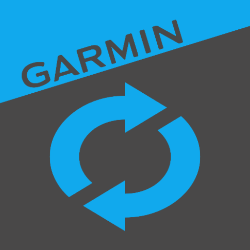

# Garmin Connect Feed

[](https://github.com/paufregi/GarminFeed/actions/workflows/build.yaml)
[](https://github.com/paufregi/GarminFeed/actions/workflows/codeql.yaml)



**ConnectFeed** is an Android application that bridges the gap between Renpho Health, Strava and Garmin Connect.
It allows you to easily synchronize your weight and body composition data from the Renpho Health app directly to your Garmin Connect account.
Additionally, ConnectFeed provides a user-friendly way to update Garmin and Strava activities using custom profiles.

## Key Features

*   **Renpho Health to Garmin Connect Sync:** Easily synchronize your weight and body composition data from the Renpho Health app directly to your Garmin Connect account.
*   **Custom Activity Profiles:** Update your Garmin activities using predefined profiles tailored to your specific needs.
*   **Strava Integration:** Enhance your Strava experience by updating activity details directly from ConnectFeed. This includes the ability to:
    *   **Update Activity Name:** Customize the name of your Strava activity, either by using a predefined profile or by copying over the corresponding name from the Garmin activity.
    *   **Update Activity Description:** Add additional details to your Strava activity description, such as training effect data or a cheeky note.
    *   **Set Commute Flag:** Mark your Strava activities as commutes, for better tracking and analysis.

## Getting Started

### Building from Source
```shell
./gradlew build
```

### Running Tests

#### Unit Tests
```shell
./gradlew test
```

#### Android Instrumented Tests
```
./gradlew pixel9ProCheck
```
